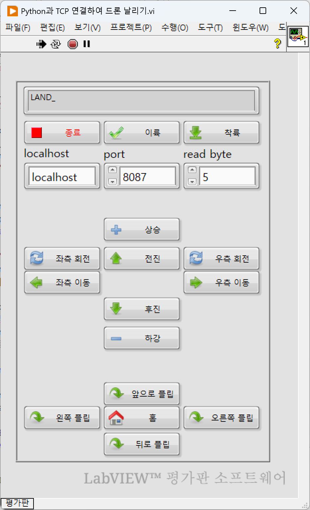
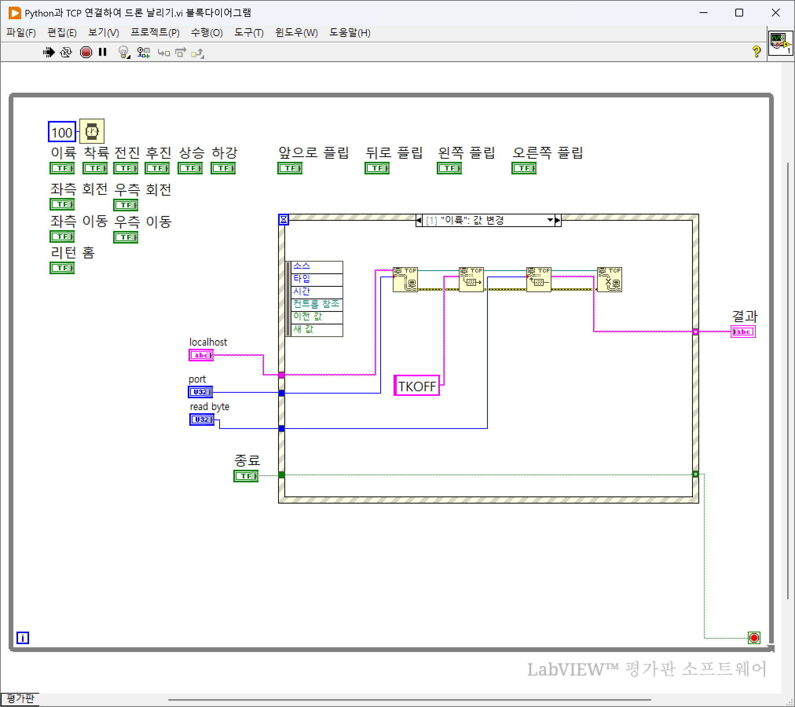
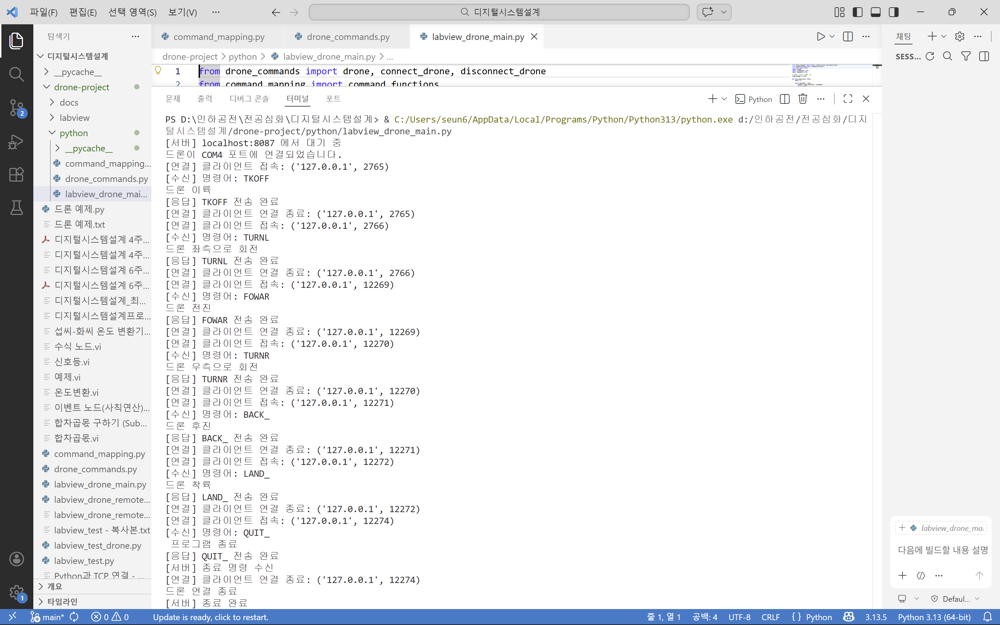

# 🚁 Drone Control System (LabVIEW + Python)

## 📌 프로젝트 개요

본 프로젝트는 **LabVIEW와 Python을 TCP 소켓 통신으로 연동하여 드론을 제어하는 시스템**을 구현한 것이다.
LabVIEW에서 사용자 입력(UI 버튼)을 통해 명령을 생성하고, Python 서버가 이를 수신하여 `e_drone` 라이브러리를 통해 실제 드론을 제어하도록 구성하였다.

---

## 🎯 프로젝트 목적

드론 제어를 단순한 코드 실행이 아닌,
UI(LabVIEW)와 제어 로직(Python)을 분리한 구조로 설계하여
실제 시스템 연동 경험을 쌓고자 프로젝트를 진행하였다.

---

## 📁 프로젝트 구조

```
drone-project/
│
├── python/
│ ├── labview_drone_main.py # 메인 실행 파일 (서버 실행)
│ ├── command_mapping.py # 명령어 매핑
│ └── drone_commands.py # 드론 제어 함수
│
├── labview/
│ └── Python과 TCP 연결하여 드론 날리기.vi (클라이언트)
│
├── docs/
│ ├── (labview) front_panel.png
│ ├── (labview) block_diagram.png
│ └── (python) python_run.png
│
├── requirements.txt
└── README.md
```

---

## 🧩 시스템 구조

```
LabVIEW (UI)
   ↓ TCP Socket (5-byte command)
Python Server
   ↓
Command Mapping
   ↓
Drone Control (e_drone SDK)
   ↓
Drone
```

---

## 🔧 기술 스택

- **Language**: Python
- **Tool**: LabVIEW, Visual Studio Code
- **Library**: e-drone, keyboard
- **Communication**: TCP Socket

* **LabVIEW**

  * Event Structure 기반 UI 제어
  * TCP Open / Write / Read / Close 통신

* **Python**

  * Socket Programming
  * Threading (비상착륙)
  * Command Mapping 구조 설계

---

## 📡 통신 프로토콜

### ✔ 명령어 규칙

* **고정 길이: 5글자**
* **의미 기반 네이밍 규칙 통일**

| 명령어   | 기능   |
| ----- | ---- |
| TKOFF | 이륙   |
| LAND_ | 착륙   |
| UPWAR | 상승   |
| DOWAR | 하강   |
| FOWAR | 전진   |
| BACK_ | 후진   |
| LEFT_ | 좌이동  |
| RIGHT | 우이동  |
| TURNL | 좌회전  |
| TURNR | 우회전  |
| RHOME | 리턴 홈 |
| FFLIP | 앞 플립 |
| BFLIP | 뒤 플립 |
| LFLIP | 좌 플립 |
| RFLIP | 우 플립 |
| QUIT_ | 종료   |

---

## ⚙️ 실행 방법

### 1️⃣ Python 환경 설정
```bash
python -m venv venv
venv\Scripts\activate   # (Windows 기준)
pip install -r requirements.txt
```

### 2️⃣ Python 서버 실행

```bash
python labview_drone_main.py
```

### 3️⃣ LabVIEW 실행

* labview 폴더 내 Python과 TCP 연결해서 드론 날리기.vi 실행
* TCP 연결 (`localhost`, port: 8087) -> 프런트패널에 정보 입력
* 버튼 클릭 시 명령 전송

---

## ⚠️ 주의 사항

드론 연결 상태 확인 후 실행
비상 상황 발생 시 아래의 **비상 착륙 기능** 사용

---

## 🔄 동작 흐름

1. LabVIEW에서 버튼 클릭
2. TCP 연결 생성
3. 5글자 명령 전송 (예: `TKOFF`)
4. Python 서버에서 명령 수신
5. 드론 제어 함수 실행
6. 동일한 명령 문자열 응답
7. LabVIEW에서 결과 표시
8. TCP 연결 종료

---

## 🚀 흐름 예시

TKOFF → 이륙  
FOWAR → 전진  
LAND_ → 착륙  

---

## 🚨 비상 착륙 기능

* Python에서 별도 스레드로 실행
* `space` 키 입력 시 즉시 착륙 수행
* 통신과 독립적으로 동작

---

## 🛠️ 주요 설계 특징

### ✔ 1. 역할 분리 구조

* `labview_drone_main.py` → 통신 및 실행 흐름
* `command_mapping.py` → 명령어 매핑
* `drone_commands.py` → 드론 제어 로직

👉 유지보수성과 확장성 향상

---

### ✔ 2. 고정 길이 프로토콜 설계

* TCP 통신 안정성을 위해 5바이트 고정 명령 사용
* 문자열 기반 명령으로 디버깅 용이

---

### ✔ 3. 클라이언트-서버 구조

* Python 서버를 **“명령 1개당 1연결” 구조로 설계**
* LabVIEW 구조 변경 없이 안정적 통신 구현

---

### ✔ 4. 예외 대응 설계

* 잘못된 명령어 → `"ERROR"` 응답
* 연결 종료 → 정상 흐름으로 처리
* 비상착륙 → 별도 스레드 처리

---

## 📷 결과 화면

### LabVIEW UI


### Block Diagram


### Python Execution


---

## 📈 개선 방향

LabVIEW 블록다이어그램 및 python 코드 개선(python 서버 실행 후 LabVIEW 클라이언트 접속 후 연결 유지 후 종료)

---

## 👨‍💻 개발자

* Yang Seong-eun
* Computer Systems Engineering

---
